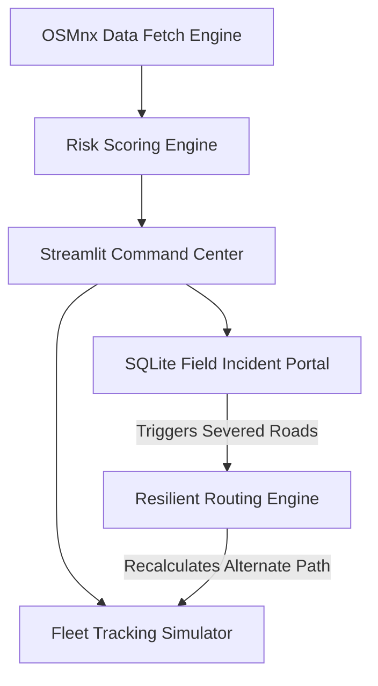

# NER Smart Logistics & Accessibility Intelligence Platform
**Prototype Solution for MDoNER Problem Statement 26002**

An integrated GIS orchestration stack built for North Eastern Region (NER) logistics resilience, providing live predictive analysis, dynamic convoy tracking, and a field-operable incident reporting loop.

## 🚀 One-Click Deployment
To launch the Dashboard on a Windows terminal:
```bash
run.bat
```
For Linux / macOS:
```bash
chmod +x run.sh && ./run.sh
```

## 🧬 System Architecture
The application coordinates 4 parallel engines to provide closed-loop disaster resolution:



## ⚠️ Prototype Transparency (Simulated Bounds)
To accelerate prototyping while successfully verifying the core mathematical constraints of the PS 26002 mandate:
- **Mock GPS Feed:** Fleet positions are geometrically interpolated across the `networkx` Road Graph using Shapely lines, bounded by a virtual Timeline Simulator.
- **Stress Weather Controls:** Real Open-Meteo API connections are deployed, but manual rainfall inputs can optionally override limits to visibly demonstrate dynamic heuristic risk scoring.
- **Offline Edge Cache:** Incident Field Reports are stored in a local SQLite (`data/incidents.db`), actively demonstrating functional "Offline Node" operations required for mountainous coverage gaps.
